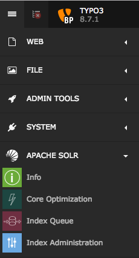
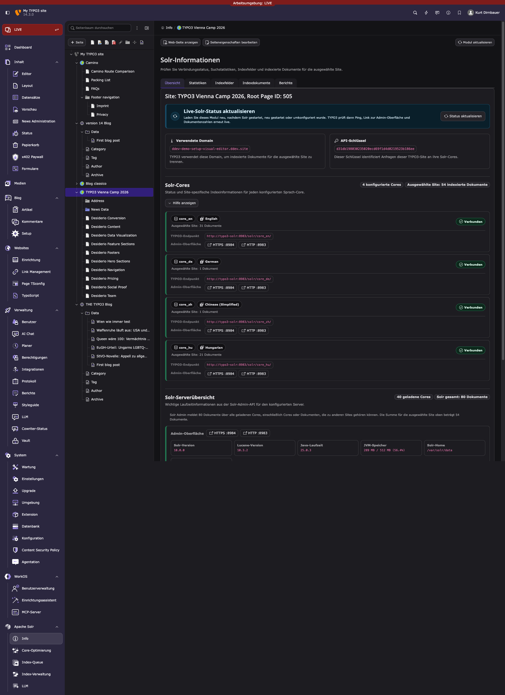
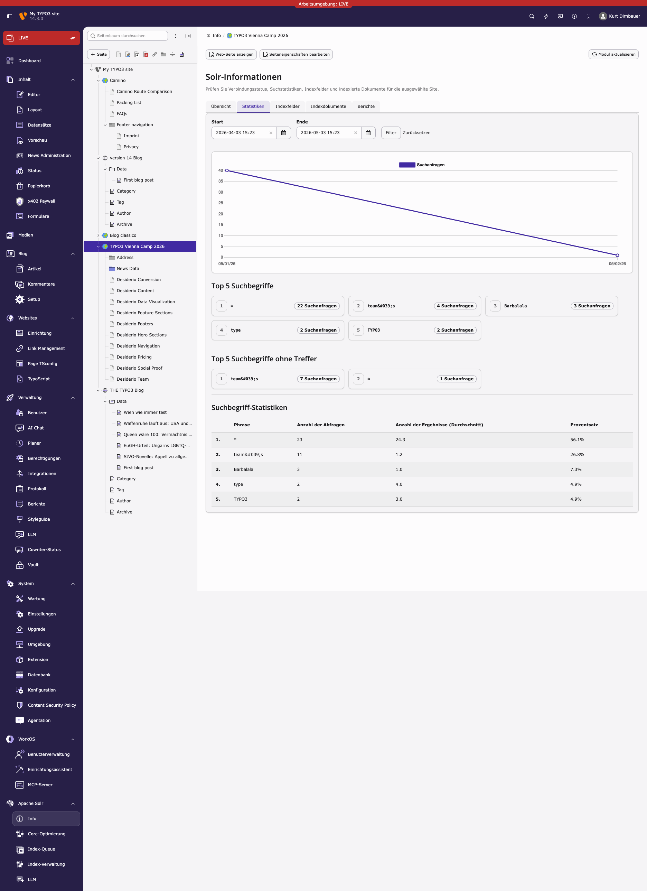
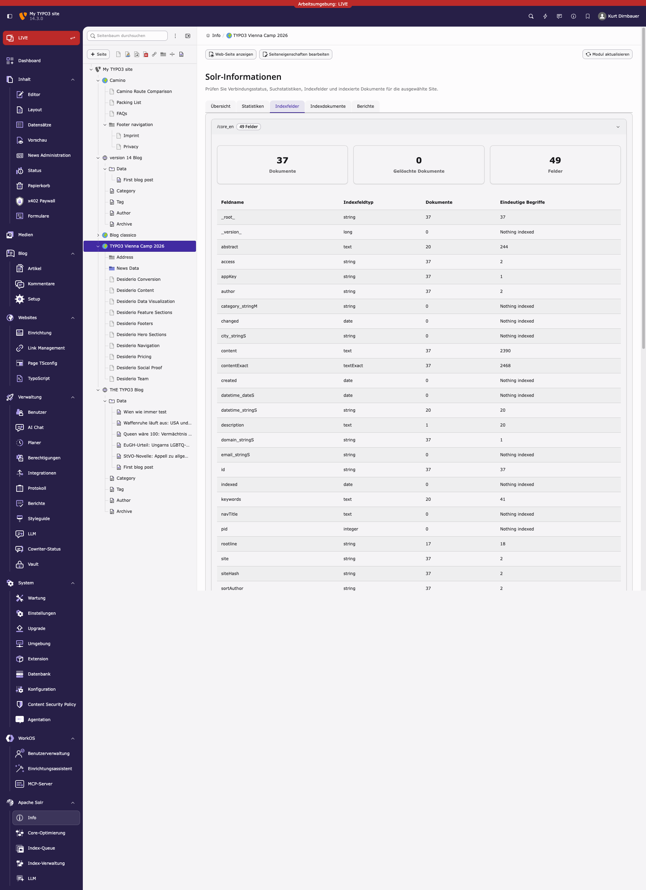
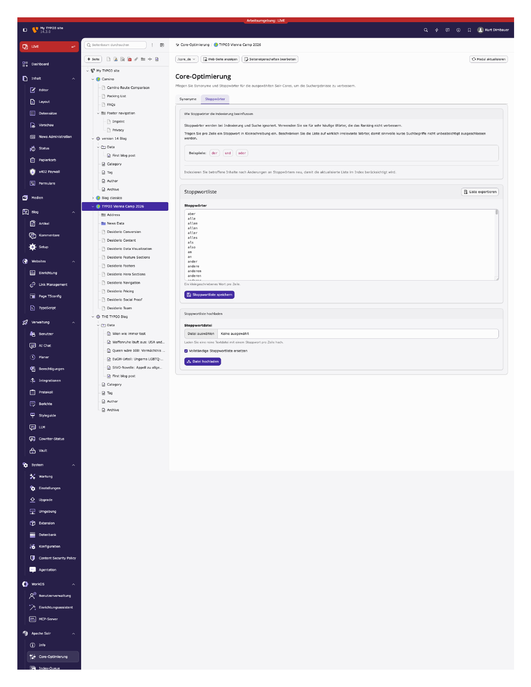
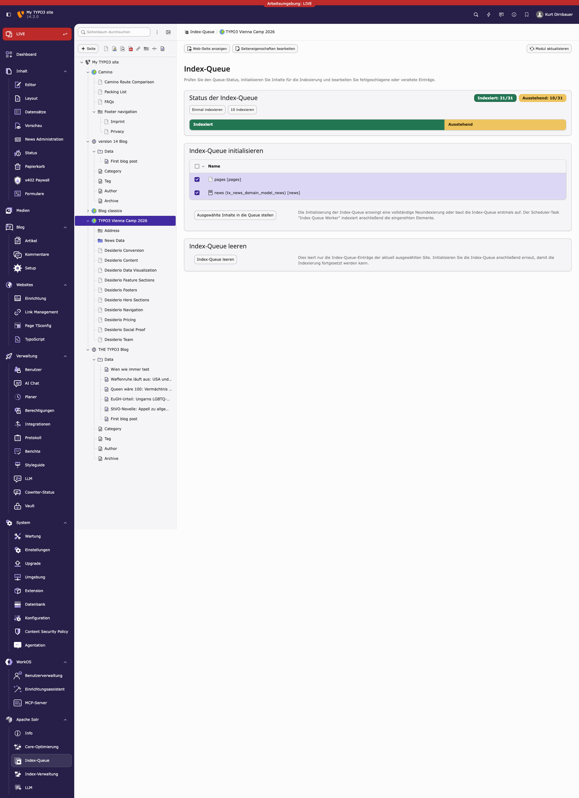
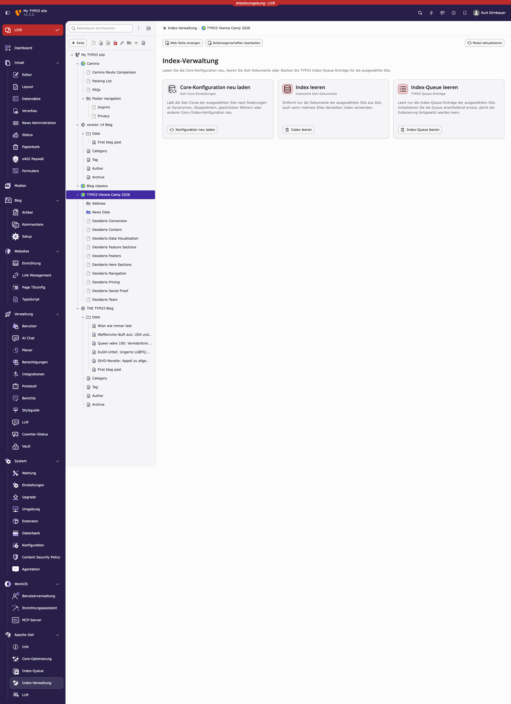

.. _backend-module:

Backend Modules
===============

The backend modules are in the "APACHE SOLR" section available and can be unlocked for BE-users or/and groups. The modules help you to do maintenance tasks and get an overview on the system status:

During the next paragraphs we will go over the modules and explain, what could be done with them.

Info Module
-----------

Info Module shows you important infos about TYPO3 CMS and Solr state.

It contains different info tabs described below:

Connections
^^^^^^^^^^^

It lists all the for the site configured connections and their status.

Statistics
^^^^^^^^^^

The **Search Statistics** module allows you to see Top Search Phrases with and without results. In addition it possible to see a
complete listing with hits etc. ranked by Top search keywords.

Index Fields
^^^^^^^^^^^^

The **Index Fields** module allows you to see, how many documents you have in which solr core and which fields those documents have.

Core Optimization
-----------------

Core optimization Module is responsive for managing the behaviour of cores. By modifying of following things, you can also change the ranking and/or the results.

.. _backend-module-stopword:

Stop Words
^^^^^^^^^^

With the stopwords module you can define a list of words that should be excluded from the search.

Common usecases are:

* Very often occurring words like "the", "and" ... are excluded are filtered out because they are more or less "noize words".
* You can add words that you want to avoid from indexing.

.. _backend-module-synonyms:

Synonyms
^^^^^^^^

With the synonyms module you can allow to find documents by words that do not occur in the document but have the same meaning:

* E.g. smartphone, cellphone, mobile, mobilephone

**Note:** The word that you want replace with a synonym needs to appear on **both** sides when you want to find it with the term itself later

Example

smartphone => smartphone, cellphone, mobile, mobilephone will match "smartphone, cellphone, mobile, mobilephone", when smartphone is missing on the right side, you will not find the document for smartphone anymore!

.. image:: ../Images/Backend/solr-backend-module_CoreOptimization-Synonyms.png

Index Queue
-----------

The **Index Queue** module is the most important module. It allows you to do the following things:

* Select item types and add them for indexing to the indexing queue.
* See the fill state of the indexing queue.
* Check the indexing queue for errors when the indexing of an items failed.
* Start an instant indexing run, directly from the module.
* Clear the indexing queue and re-queue items.

Index Administration (earlier Index Maintenance)
------------------------------------------------

The **Index Administration** module allows you, to do the following administrative operations on your solr index:

* Reload the solr configuration.
* Empty your solr index. This removes all documents from the index of the current selected site.
* Clear the indexing queue.

