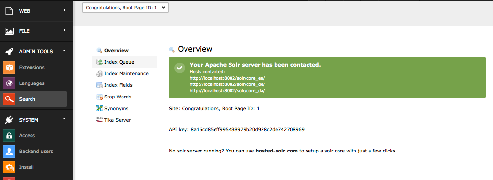
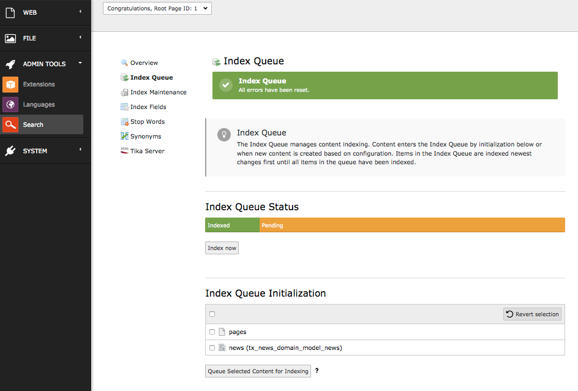
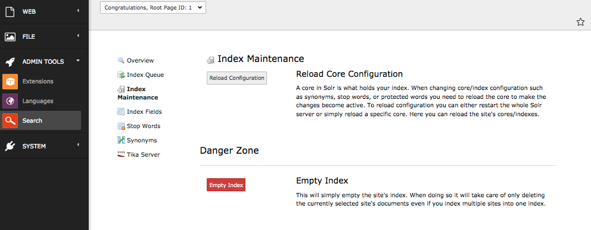
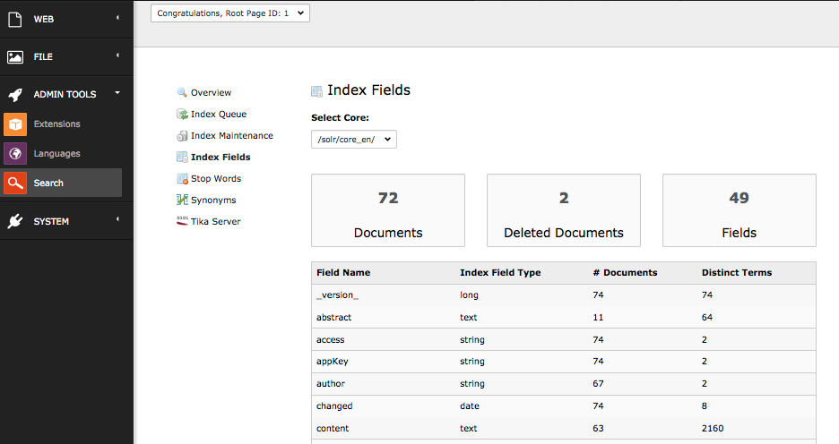
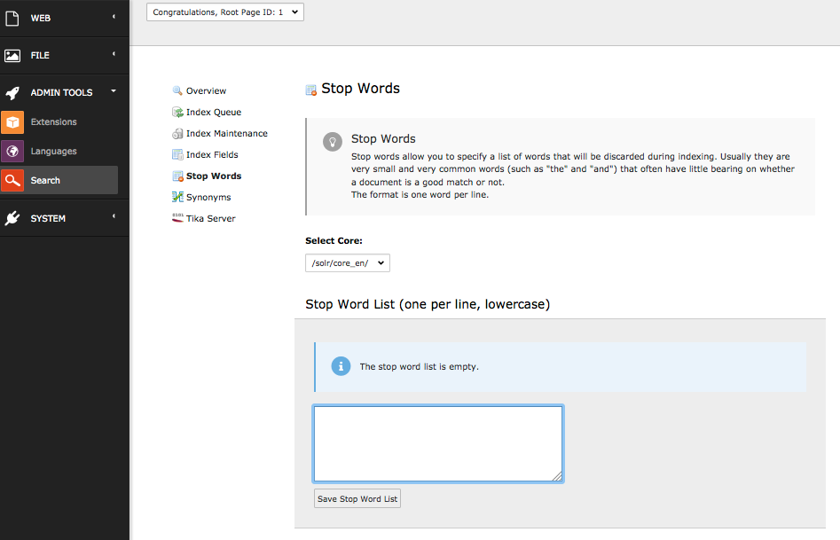
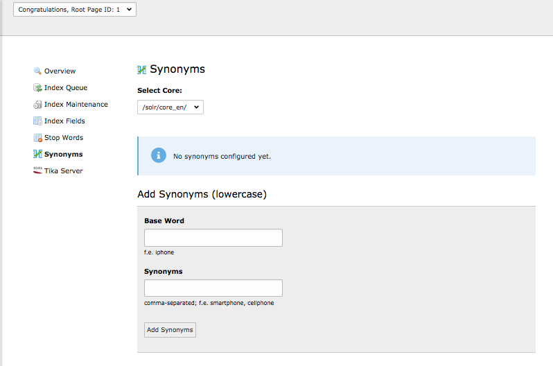

.. raw:: latex

    \newpage

.. raw:: pdf

   PageBreak

.. _backend-module:

Backend Module
==============

The solr backend module is available for admins only in the "Admin Tools" section and it helps you to do maintenance tasks and get an overview on the system status:

During the next paragraphs we will go over the modules and explain, what could be done with them.

Index Queue
-----------

The **Index Queue** module is the most important module. It allows you to do the following things:

* Select item types and add them for indexing to the indexing queue.
* See the fill state of the indexing queue.
* Check the indexing queue for errors when the indexing of an items failed.
* Start an instant indexing run, directly from the module.
* Clear the indexing queue and re-queue items.

Index Maintenance
-----------------

The **Index Maintenance** module allows you, to do the following administrative operations on your solr index:

* Reload the solr configuration.
* Empty your solr index. This removes all documents from the index of the current selected site.

Index Fields
------------

The **Index Fields** module allows you to see, how many documents you have in which solr core and which fields those documents have.

Stop Words
----------

With the stopwords module you can define a list of words that should be excluded from the search.

Common usecases are:

* Very often occuring words like "the", "and" ... are excluded are filtered out because they are more or less "noize words".
* You can add words that you want to avoid from indexing.

Synonyms
--------

With the synonyms module you can allow to find documents by words that do not occure in the document but have the same meaning:

* E.g. cellphone, mobile, mobilephone

