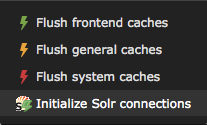

.. _connection-manager:

ConnectionManager
=================


TYPO3 Site mode
---------------

You can configure all solr connection properties along with your TYPO3 site in the site module.

The configuration in the UI is limited to the following settings to keep the setup as simple as possible:

Global:

* Scheme
* Host
* Port
* Path to cores

Languagelevel:

* Solr core name

If you have a more complex setup or need to configure username and password please configure solr by editing the yaml file.

The fallback mechanism allows you to overwrite settings on the language level.

The fallback mechanism work like that:

Each setting has the following structure ``solr_{$setting}_{$scope}"```. The scope can be read or write. Every setting can be overwritten for the scope *write*, if nothing is configured it will fallback to the *read* setting. Every setting can be defined on the language level, if it is not configured on the language level it fallsback to the global setting.

Example:

::

    base: 'http://solr-ddev-site.ddev.site/'
    baseVariants: {  }
    errorHandling: {  }
    languages:
      -
        title: English
        enabled: true
        base: /
        typo3Language: default
        locale: en_US.UTF-8
        iso-639-1: en
        navigationTitle: ''
        hreflang: en-US
        direction: ''
        flag: global
        solr_host_read: solr_node_1
        solr_core_read: core_en
        languageId: '0'
      -
        title: German
        enabled: true
        base: /de/
        typo3Language: de
        locale: de_DE.UTF-8
        iso-639-1: de
        navigationTitle: ''
        hreflang: de-DE
        direction: ''
        flag: global
        solr_host_read: solr_node_2
        solr_core_read: core_de
        languageId: '1'
    rootPageId: 3
    routes: {  }
    solr_enabled_read: true
    solr_path_read: /solr/
    solr_port_read: 8983
    solr_scheme_read: http
    solr_use_write_connection: false

::

The example above shows that you are able to define the setting ```solr_host_read``` on the language level. Since this is a more advanced configuration and the user interface should be kept simple, this can only be configured in the yaml.

Legacy Mode
-----------

.. warning::

   The ability to use this mode will be removed in EXT:solr 11.0.

In EXT:solr all the configuration, including options affecting backend functions, are done in TypoScript. The clear cache menu provides an entry to initialize the Solr connections configured in TypoScript.


* Configure the Solr connection in TypoScript under plugin.tx_solr.solr, providing host, port, and path.
* On your site's root page set the flag Use as Root Page on the Behaviour tab.
* Initialize the Solr connections through the clear cache menu



    Initialize all solr connections

When initializing the Solr connections the extensions looks for all the pages with the root flag set, generates the TypoScript configuration for that page like in the frontend and reads the Solr connection parameters.

The extension also repeats that process for each language configured on the installation's root (uid = 0). This way you can configure different Solr cores for each language by using regular conditions that change the path of the Solr connection depending on the currently selected language.

Once all the configured Solr connections in the installation are found, they're stored in TYPO3's registry so that they can easily be retrieved without needing to reevaluate the TypoScript configuration every time we connect to Solr.

All that magic happens in class source:Classes/ConnectionManager.php. The connection manager and it's public API actually must be used whenever a Solr connection is needed.