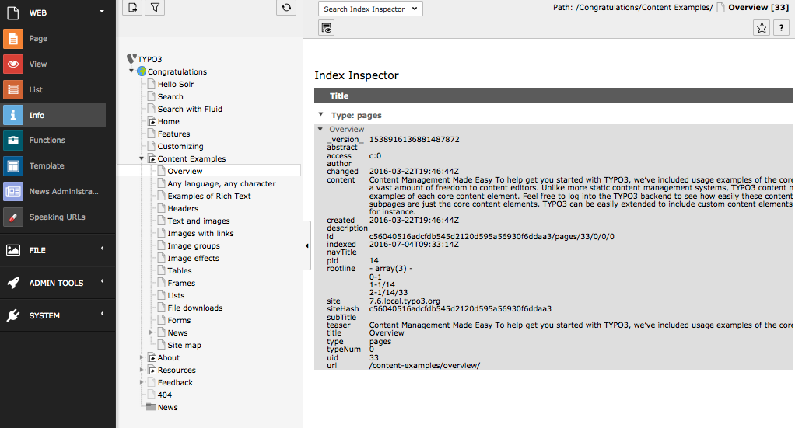

.. _backend-index-inspector:

Index Inspector
===============

Beside the own backend module, EXT:solr provides a feature called **"Search Index Inspector"**. This Tool allows you to select a page or sysfolder and check
what data is stored for this entity in the solr index.

The **"Search Index Inspector"** can be opened with the TYPO3 Info Module (*"Web > Info > Search Index Inspector"*) it shows the stored data in solr from the page or sysfolder that is selected in the pagetree:

    The EXT:solr Search Index Inspector

