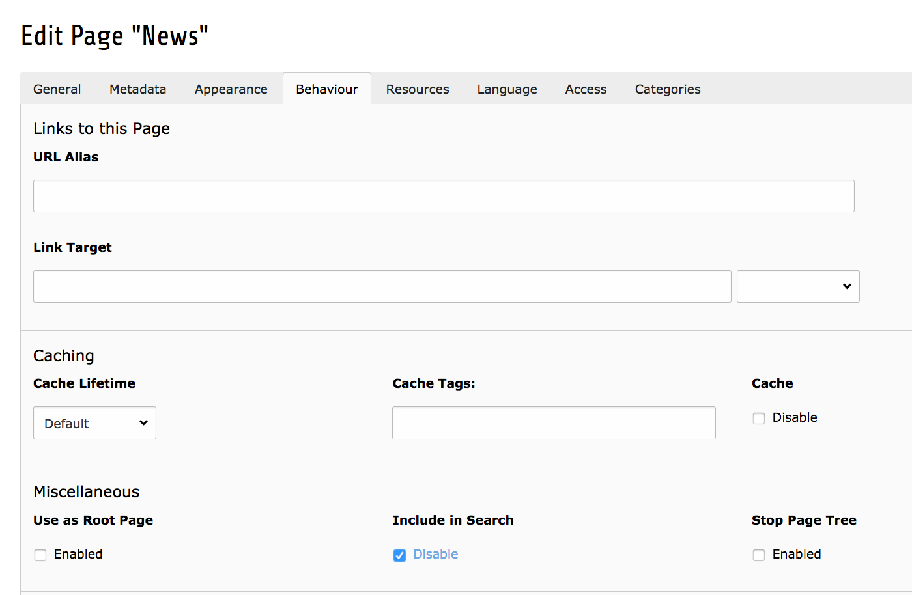

.. _backend-index-queue:

IndexQueue Configuration
========================

As you already learned you can index pages very easy with EXT:solr and setup a search for pages in seconds. Beside pages, there might be other records in your TYPO3 CMS that you want to have available in your search results.

Indexing custom records
-----------------------

As a core feature EXT:solr allows you to write custom typoscript configuration to index records from any extension just with configuration. To see how this is working, we open the content of the TypoScript example **"Search - Index Queue Configuration for news"** that can be found in "Configuration/TypoScript/Examples/IndexQueueNews":

|

.. code-block:: typoscript

    plugin.tx_solr.index.queue {

        news = 1
        news {
            table = tx_news_domain_model_news

            fields {
                abstract = teaser

                author = author
                authorEmail_stringS = author_email

                title = title

                content = SOLR_CONTENT
                content {
                    cObject = COA
                    cObject {
                        10 = TEXT
                        10 {
                            field = bodytext
                            noTrimWrap = || |
                        }
                    }
                }

                category_stringM = SOLR_RELATION
                category_stringM {
                    localField = categories
                    multiValue = 1
                }

                keywords = SOLR_MULTIVALUE
                keywords {
                    field = keywords
                }

                tags_stringM = SOLR_RELATION
                tags_stringM {
                    localField = tags
                    multiValue = 1
                }

                url = TEXT
                url {
                    typolink.parameter =  {$plugin.tx_news.settings.detailPid}
                    typolink.additionalParams = &tx_news_pi1[controller]=News&
                        tx_news_pi1[action]=detail&tx_news_pi1[news]={field:uid}
                    typolink.additionalParams.insertData = 1
                    typolink.useCacheHash = 1
                    typolink.returnLast = url
                }
            }

            attachments {
                fields = related_files
            }
        }

    }

    plugin.tx_solr.logging.indexing.queue.news = 1

|

By reading the example above you might recognize the following facts:

* The indexing configuration is done in the TypoScript path 'plugin. tx_solr. index. queue. [configName]' and there can be multiple queue configurations.
* The database table is configured in the property 'plugin.tx_solr.index.queue.[configName].table'. This allows you to have multiple index queue configurations for the same database table. This can be helpful when you have multiple queue configurations for news (e.g. if you have a press & corporate news section on your website).
* The solr fields are configured in 'plugin.tx_solr.index.queue.[configName].fields'. This allows you to flexibly fill any solr field. The combination of dynamic fields (:ref:`appendix-dynamic-fields`) and the queue configuration allows you to write any kind of data into solr without adapting the solr schema.
* There are custom TypoScript objects from EXT:solr that are used in the index queue configuration
   - :ref:`index-helper-solr-content`
   - :ref:`index-helper-solr-relation`
   - :ref:`index-helper-solr-multivalue`

When the index queue configuration of your custom record is ready, you can check the index queue in the backend module and add the news items to the queue.

Links in custom records
-----------------------

In the example above *typolink* is used to build a link to the detail view of the news. This is required, because EXT:solr can not know the business logic of the news extension to build a detail link.
The typoscript constant "plugin.tx_news.settings.detailPid" is used to configure the target pageId of the news single view. This has two important impacts:

* The constant (*plugin.tx_news.settings.detailPid*) need to point to a valid news single page.
* The page with the news single view, should be configured with *"Include in Search => Disable"* because indexing this page with the normal page indexing without a news id will produce an error page.

    Include in Search - Disable