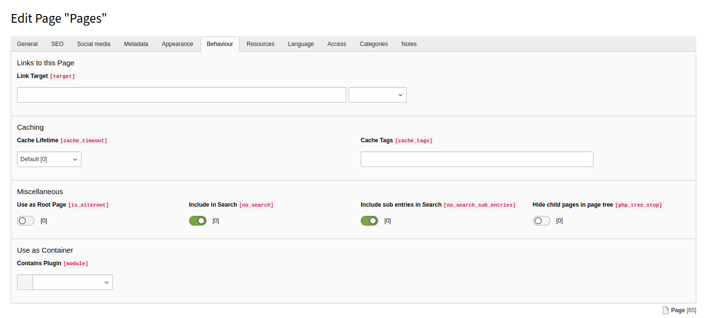

.. _backend-page-properties:

===============
Page properties
===============

EXT:solrs indexing behaviour depends on page properties.
Depending on the state of page properties the pages and or sub pages may be indexed or not.

.. _pages-properties-behaviour:

Behaviour
=========

   The **Behaviour** tab of the page properties

Include in Search (no_search)
  By default, every allowed page is indexed. Use this flag to
  exclude the current page from being indexed.

Include sub entries in Search (no_search_sub_entries)
  Use this flag, to be able to exclude sub pages from index recursively.
  By unsetting this flag, the sub pages/entries of desired page will be excluded from index.

    .. tip::

        To exclude the page and its sub pages disable no_search and no_search_sub_entries at same time.
