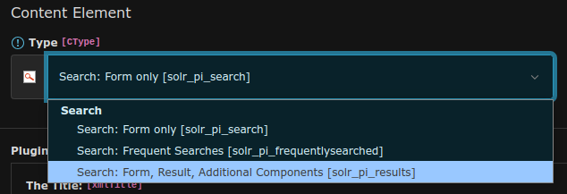

=======
Plugins
=======

EXT:solr provides the following plugin instances that can be configured in the backend:

* Results plugin: **"Search: Form, Result, Additional Components"**
* Form plugin: **"Search: Form only"**
* Frequent Searches plugin: **"Search: Frequent Searches"**

