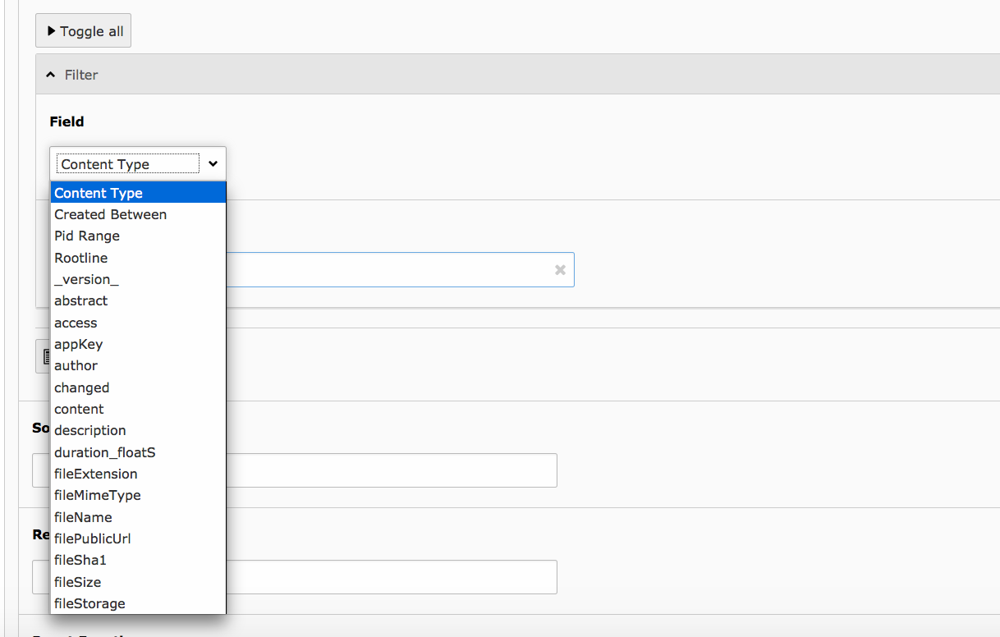

Results Plugin
==============

The results plugin is the most important plugin of the extension. It is responsible to render a search form
and the results.

Flexform Configuration
----------------------

All configuration can be done with TypoScript and the settings from EXT:solr are used. For some settings it makes sence to overwrite them with the flexform in the plugin settings.

The following settings can be overwritten by instance with the flexform:

**"Target Page"**:

Target page that should be used when a search is submitted. This can be usefull
when you want to show the results on another page.

When nothing is configured the current page will be used.

+-----------------------------+--------------------------------------------------+
| Overwritten TypoScript Path | plugin.tx_solr.search.targetPage                 |
+-----------------------------+--------------------------------------------------+
| Type:                       | Integer                                          |
+-----------------------------+--------------------------------------------------+

**"Initialize search with empty query"**:

If enabled, the results plugin issues a "get everything" query during initialization. This is useful, if you want to create a page that shows all available facets although no search has been issued by the user yet.

**Note**: Enabling this option alone will not show results of the get everything query. To also show the results of the query, see option *Show results of initial empty query* below.

+-----------------------------+--------------------------------------------------+
| Overwritten TypoScript Path | plugin.tx_solr.search.initializeWithEmptyQuery   |
+-----------------------------+--------------------------------------------------+
| Type:                       | Boolean                                          |
+-----------------------------+--------------------------------------------------+

**"Show results of initial empty query"**:

Requires **"Initialize search with empty query"** (above) to be enabled to have any effect. If enabled together with **"Initialize search with empty query"** the results of the initial "get everything" query are shown. This way, in combination with a filter you can easily list a predefined set of results.

+-----------------------------+--------------------------------------------------------+
| Overwritten TypoScript Path | plugin.tx_solr.search.showResultsOfInitialEmptyQuery   |
+-----------------------------+--------------------------------------------------------+
| Type:                       | Boolean                                                |
+-----------------------------+--------------------------------------------------------+

**"Initialize with query"**:

This configuration can be used to configure an initial query string that is triggered when the plugin is rendered.

+-----------------------------+--------------------------------------------------------+
| Overwritten TypoScript Path | plugin.tx_solr.search.initializeWithQuery              |
+-----------------------------+--------------------------------------------------------+
| Type:                       | String                                                 |
+-----------------------------+--------------------------------------------------------+

**"Show results of initial query"**:

This option is used to configure if the results of an initial query should be shown.

+-----------------------------+--------------------------------------------------------+
| Overwritten TypoScript Path | plugin.tx_solr.search.showResultsOfInitialQuery        |
+-----------------------------+--------------------------------------------------------+
| Type:                       | Boolean                                                |
+-----------------------------+--------------------------------------------------------+

**"Filters"**:

This flexform element allows you to define custom filters by selecting a solr field and a value:

+-----------------------------+--------------------------------------------------------+
| Overwritten TypoScript Path | plugin.tx_solr.search.query.filter.                    |
+-----------------------------+--------------------------------------------------------+
| Type:                       | Array                                                  |
+-----------------------------+--------------------------------------------------------+

**"Sorting"**:

When you want to sort initially by a field value and not by relevance this can be configured here.

+-----------------------------+--------------------------------------------------------+
| Overwritten TypoScript Path | plugin.tx_solr.search.query.sortBy                     |
+-----------------------------+--------------------------------------------------------+
| Type:                       | String                                                 |
+-----------------------------+--------------------------------------------------------+
| Example:                    | title desc                                             |
+-----------------------------+--------------------------------------------------------+

**"Boost Function"**:

A boost function can be useful to influence the relevance calculation and boost some documents to appear more at the beginning of the result list.
Technically the parameter will be mapped to the **"bf"** parameter in the solr query.

Use cases for example could be:

**"Give never documents a higher priority":**

This could be done with a recip function:

.. code-block:: bash

    recip(ms(NOW,created),3.16e-11,1,1)

**"Give documents with a certain field value a higher priority":**

This could be done with:

.. code-block:: bash

    termfreq(type,'tx_solr_file')

+-----------------------------+--------------------------------------------------------+
| Overwritten TypoScript Path | plugin.tx_solr.search.query.boostFunction              |
+-----------------------------+--------------------------------------------------------+
| Type:                       | String                                                 |
+-----------------------------+--------------------------------------------------------+
| Example:                    | recip(ms(NOW,created),3.16e-11,1,1)                    |
+-----------------------------+--------------------------------------------------------+

See also:

https://cwiki.apache.org/confluence/display/solr/The+DisMax+Query+Parser#TheDisMaxQueryParser-Thebf%28BoostFunctions%29Parameter
https://cwiki.apache.org/confluence/display/solr/Function+Queries

**"Boost Query"**:

The boostQuery is a query that can be used for boosting. Technically it is mapped to the **"bq"** parameter of the solr query. Compared to boost a function a boost query provides less use cases.

An example could be to boost documents based on a certain field value:

**type:tx_solr_file**

+-----------------------------+--------------------------------------------------------+
| Overwritten TypoScript Path | plugin.tx_solr.search.query.boostQuery                 |
+-----------------------------+--------------------------------------------------------+
| Type:                       | String                                                 |
+-----------------------------+--------------------------------------------------------+
| Example:                    | type:tx_solr_file                                      |
+-----------------------------+--------------------------------------------------------+

See also:

https://cwiki.apache.org/confluence/display/solr/The+DisMax+Query+Parser#TheDisMaxQueryParser-Thebq%28BoostQuery%29Parameter
