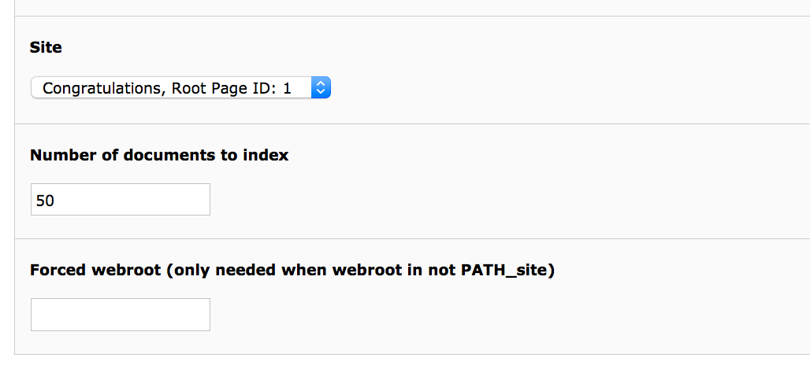
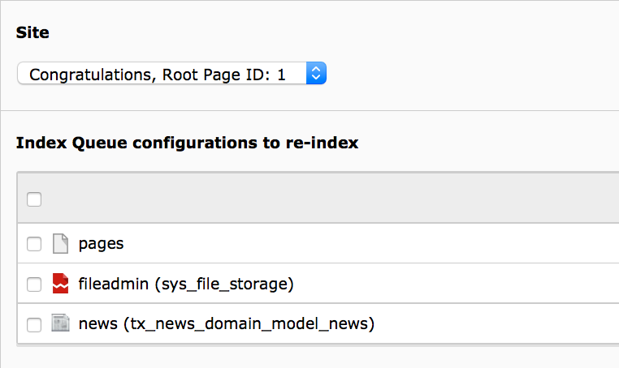

.. _backend-scheduler:

Scheduler
=========

When you want to index content from TYPO3 into solr automatically EXT:solr ships scheduler tasks, that can be called at a configured time or directly from the backend.

Index Queue Worker
------------------

Changes that are done in the backend by an editor are written into a queue. This queue is processed asynchronously with a scheduler task and each item in the queue is indexed into solr.

The **"Index Queue Worker"** task has the following custom properties:

**Site:** Here you select the solr site, that you want to index with this task instance.
**Number of documents to Index:** Here you can configure how many documents you want to index in one run. Depending on the performance of your system and the expected update time of the search you can choose a realistic number here.
**Forced webroot:** The scheduler task can be executed in the cli context, because no webserver is used there, TYPO3 is unable to detect your webroot. As assumption we use PATH_site as default here. When you need to configure something else, you can do it with this option. You can use the marker ###PATH_site### and ###PATH_typo3### to define relative pathes here, to be independent from the concrete instance.

    The EXT:solr Index Queue Worker - Scheduler Task

Force Re-Indexing of a site
---------------------------

This task allows you to force the re-indexing of a site & indexing configuration at a planned time.

The **Force Re-Indexing of a site** task has the following custom properties:

**Site**: Here you select the solr site, that you want to index with this task instance.
**Index Queue configurations to re-index**: Here you can limit the set of indexing configurations that should be Re-Indexed.

    The EXT:solr Force Re-Indexing of a site - Scheduler Task