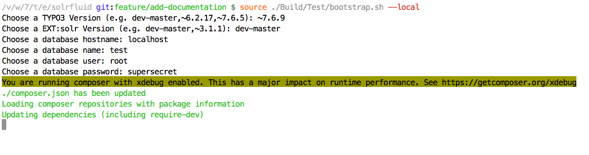
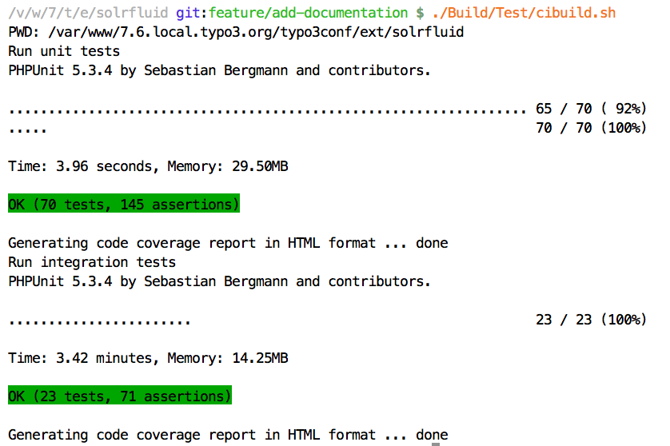

=================================
Testing and Continues Integration
=================================

The goal during the development of EXT:solr is, to test most of the components with unit and integration tests.

Unit Tests
==========

For the single classes we've added unit tests whenever we though it is usefull. The unit tests should run very quickly, to git a quick response.

Integration Tests
=================

As in EXT:solr the integration tests are more complex and test the integration of the different components. Since a database server and a solr server is required this is needed to run the integration test suite. During the bootstrap of the test environment, we use the TYPO3 core functionality for database tests and we install a local solr server with out install script.

To simplify the local usage of the unit and integration tests, we ship a few bash script that support you to get everything started.

Bootstrapping the Test Environment
==================================

When you want to start the testrunner in your shell you need to bootstrap it once:

.. code-block:: bash

    source ./Build/Test/bootstrap.sh --local

The bootstrapper will prompt for some values:

When the boostrapper was finished successful the following was done:
    * Environment variables for the TYPO3 testing framework have been exported
    * Test database was created
    * Test solr instance was created

Afterwards you can run the ci suite in your shell

Running the ci Suite
====================

When the test environment was boostrapped correctly you can start the test runner:

.. code-block:: bash

    ./Build/Test/cibuild.sh

When everything is configured correctly all tests should run through and you should get a green bar:

