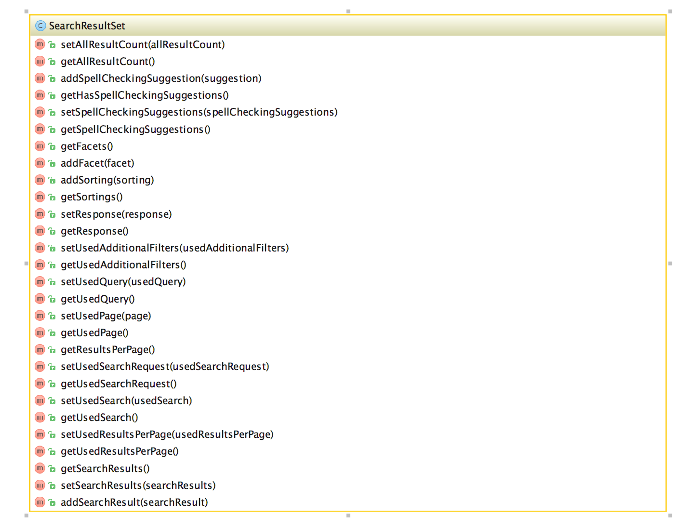
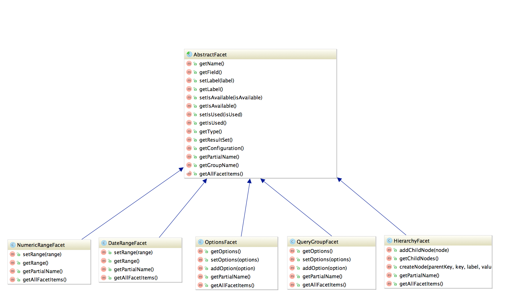

==============
Code Structure
==============

The components of EXT:solrfluid have been developed with the domain driven design (DDD) approach (https://de.wikipedia.org/wiki/Domain-driven_Design) for our extension we tried to separate the code by the following layers:

* **Domain**: Everything that is related to the "search" domain should be implemented here.
* **System**: Everything that is related to the "system" (e.g. TYPO3 specific) should be implemented here.

Domain Layer & Domain Model
===========================

The classes of the domain layer are located in "Classes/Domain" and should contain everything that is related to the "search domain".

ResultSet
---------

The "SearchResultSet" is the main entity that you get passed to the view. It can be used to access all search related objects on your result page.

    UML diagram of the SearchResutSet

The SearchResultSet can be used e.g. to get facets and spelling suggestions. A focus for the first release was a new domain model for facets,
that can be rendered with fluid or any other template engine.

**Facets**

The following UML diagram shows the implemented facets in EXT:solrfluid. Every facet has one or more facet items attached.
For the **OptionsFacet** the FacetItem is an **Option**, for the **NumericRangeFacet** a **NumericRange**.

Rendering of a facet:

Based on the **"type"** TypoScript configuration the **"FacetRegistry"** chooses the responsible facet package class that
is used to create the object structure from the solr repsonse. Each facet type is shipped with a default fluid partial, that is able to render such a facet.

A facet package consists of the following parts:

* The facet parser: Responsible to parse the apache solr response into a domain object structure
* The url decoder: Responsible to decode the url fragment of the facet in EXT:solr
* The query builder: Responsible to build the needed query fragment for Apache Solr to apply the facet

The typoscript configuration **"partialName"** can be used to force the rendering with another fluid partial.

For advanced use cases you can use the **"FacetRegistry"** to register your own facet type or overwrite the facet behaviour for a certain facet type.

    UML diagram of the \*Facet classes

As you see in the diagram above solr ships a clean object structure of the facets, that you can render in your custom templates as you need them.
