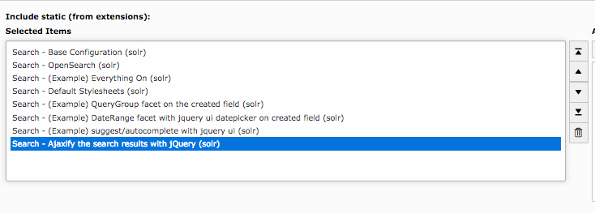

=================
Ajaxified Results
=================

To improve the use experience and the performance it is possible to load most of the sub requests with ajax.

To activate the **"ajaxification"** you need to include the typoscript template **"Search - Ajaxify the searchresults with jQuery"**

    Include EXT:solr ajaxify template

How it works?
=============

For all links with the css class **"solr-ajaxified"** the javascript search controller triggers the request against the same search page but with the type *"7383"* which is just rendering the search request.
The response is replacing everything in the container "div.tx_solr" with the content of the response.

Limitations
===========

Since the example only renders the plugin on a specific page type and not the same plugin instance as on the page, settings from the flexform are not taken into account by now.
