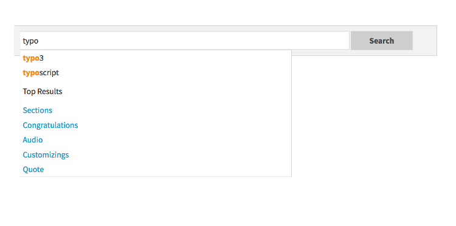

===========
Autosuggest
===========

A user of the search typically want to find the results a fast as possible. To support the user and avoid to much typing
solr can create a drop down list of common suggested search terms right after the search input box.

This feature can be easily configured with the following typoscript setting:

.. code-block:: typoscript

    plugin.tx_solr {
        suggest = 1
        suggest {
            numberOfSuggestions = 10
            suggestField = spell
        }
    }

Beside the server related part EXT:solr ships the jQuery autocomplete implementation to show the suggest results.

The suggest implementation uses the devbridge/jQuery-Autocomplete library(https://github.com/devbridge/jQuery-Autocomplete) to render the autocomplete.

If you want to configure an the autosuggest by example, you can include the typoscript example template **"(Example) Suggest/autocomplete with jquery"**.

When everything is configured the frontend will show you a drop down of suggestions when you are typing in the search field:

    Autocomplete with jQuery

Beside search term suggestions the autocomplete an also show you the top search results for the user input.

This feature can be enabled with:

.. code-block:: typoscript

    plugin.tx_solr.suggest.showTopResults = 1

If you want to change the number of proposed top results you can also configure them:

.. code-block:: typoscript

    plugin.tx_solr.suggest.numberOfTopResults = 5

