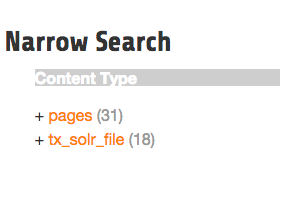
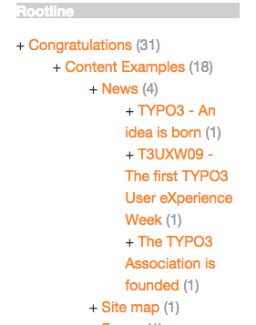
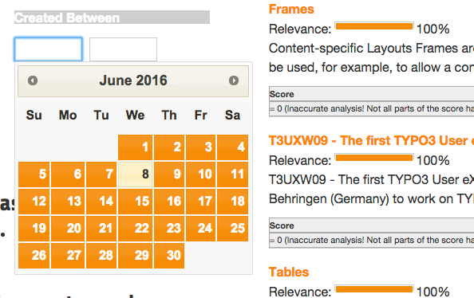

======
Facets
======

The goal of a good search is, that the user will find what he is looking for as fast as possible.
To support this goal you can give information from the results to the user to "drill down" or "filter" the results
up to a point where he exactly finds what he was looking for. This concept is called "faceting".

Imagine a user in an online shoe shop is searching for the term "shoe", wouldn't it be useful to allow
the user to filter by "gender", "color" and "brand" to find exactly the model where he is looking for?

In the following paragraphs we will get an overview about the different facet types that can be created on a solr field
just by adding a few lines of configuration.

Facet Types
===========

A solr field can contain different type of data, where different facets make sence. The simplest facet is an option "facet".
The "options facet" just contains a list of values and the user can choose one or many of them. A more complex type
could be a "range facet" on a price field. A facet like this needs to allow to filter on a range of a minimum and a maximum value.

The "type" of a facet can be controlled with the "type" property. When nothing is configured there, the facet will be threated
as option facet.

.. code-block:: typoscript

    plugin.tx_solr.search.faceting.facets.[faceName].type = [typeName]

Valid types could be: options | queryGroup | hierarchy | dateRange | numericRange

In the following paragraphs we will introduce the available facet types in EXT:solr and show how to configure them.

Option
------

The simplest and most often used facet type is the options facet. It renders the items that could be filtered as a simple list.

To setup an simple options facet you can use the following TypoScript snipped:

.. code-block:: typoscript

    plugin.tx_solr.search {
        faceting = 1
        faceting {
            facets {
                contentType {
                    label = Content Type
                    field = type
                }
            }
        }
    }

By using this configuration you create an options facet on the solr field "type" with the name "contentType". This field represents the record type, that was
indexed into solr. Shown in the frontend it will look like this:

    Options Facet

**Summary:**

+-----------------+------------------------------------------------------------+
| Type            | options                                                    |
+-----------------+------------------------------------------------------------+
| DefaultPartial  | Partials\\Facets\\Options.html                             |
+-----------------+------------------------------------------------------------+
| Domain Classes  | Domain\\Search\\ResultSet\\Facets\\OptionBased\\Options\\* |
+-----------------+---------------+--------------------------------------------+

**Grouping by option prefix**:

When you have an option facet with very much options you might want to group the options by an prefix of an option. This can be used e.g. to group the options alphabetically.

The following example shows how options can be grouped by prefix (from EXT:solr/Configuration/TypoScript/Examples/Facets/OptionsPrefixGrouped/setup.txt):

.. code-block:: xml

    <s:facet.options.group.prefix.labelPrefixes options="{facet.options}" length="1" sortBy="alpha">
        <f:for each="{prefixes}" as="prefix">
            <li>
                {prefix}
                <ul>
                    <s:facet.options.group.prefix.labelFilter options="{facet.options}" prefix="{prefix}">
                        <f:for each="{filteredOptions}" as="option">
                            <li class="facet-option" data-facet-item-value="{option.value}">
                                + <a class="facet solr-ajaxified" href="{s:uri.facet.addFacetItem(facet: facet, facetItem: option)}">{option.label}</a>
                                ({option.documentCount})
                            </li>
                        </f:for>
                    </s:facet.options.group.prefix.labelFilter>
                </ul>
            </li>
        </f:for>
    </s:facet.options.group.prefix.labelPrefixes>

Query Group
-----------

The query group facet renders an option list, compareable to the options facet, but the single options are not created from
plain solr field values. They are created from dynamic queries.

A typical usecase could be, when you want to offer the possiblity to filter on the creation date and want to offer options like "yesterday", "last year" or "more then five years".

With the following example you can configure a query facet:

.. code-block:: typoscript

    plugin.tx_solr.search {
        faceting = 1
        faceting {
            facets {
                 age {
                    label = Age
                    field = created
                    type = queryGroup
                    queryGroup {
                        week.query = [NOW/DAY-7DAYS TO *]
                        old.query = [* TO NOW/DAY-7DAYS]
                    }
                }
            }
        }
    }

The example above will generate an options facet with the output "week" (for items from the last week) and "old" (for items older then one week).

The output in the frontend will look like this:

    Solr queryGroup facet

An more complex example is shipped with this extension and can be enabled by including the template **"Search - (Example) Fluid queryGroup facet on the field created"**,
this example makes also use of renderingInstructions to render nice labels for the facet.

**Summary:**

+-----------------+---------------------------------------------------------------+
| Type            | queryGroup                                                    |
+-----------------+---------------------------------------------------------------+
| DefaultPartial  | Partials\\Facets\\Options.html                                |
+-----------------+---------------------------------------------------------------+
| Domain Classes  | Domain\\Search\\ResultSet\\Facets\\OptionBased\\QueryGroup\\* |
+-----------------+---------------+-----------------------------------------------+

Hierarchical
------------

With the hierarchical facets you can render a tree view in the frontend. A common usecase is to render a category tree where a document belongs to.

With the following example you render a very simple rootline tree in TYPO3:

.. code-block:: typoscript

    plugin.tx_solr.search {
        faceting = 1
        faceting {
            facets {
                pageHierarchy {
                    field = rootline
                    label = Rootline
                    type = hierarchy
                }
             }
        }
    }

The example above just shows a simple example tree that is just rendering the uid's of the rootline as a tree:

    Hierachy facet

A more complex example, that is rendering the pagetree with titles is shipped in the extension. You can use it by
including the example TypoScript **"Search - (Example) Fluid hierarchy facet on the rootline field"**:

    Hierachy rootline facet

**Summary:**

+-----------------+---------------------------------------------------------------+
| Type            | hierarchy                                                     |
+-----------------+---------------------------------------------------------------+
| DefaultPartial  | Partials\\Facets\\Hierarchy.html                              |
+-----------------+---------------------------------------------------------------+
| Domain Classes  | Domain\\Search\\ResultSet\\Facets\\OptionBased\\Hierarchy\\*  |
+-----------------+---------------+-----------------------------------------------+

**Technical solr background:**

Technically the hierarchical facet for solr is the same as a flat options facet. The support of hierarchies is implemented,
by writing and reading the facet options by a convention:

.. code-block:: typoscript

    [depth]-/Level1Label/Level2Label

When you follow this convention by writing date into a solr field you can render it as hierarchical facet. As example you can check indexing configuration in EXT:solr (EXT:solr/Configuration/ TypoScript/Solr/setup.txt)

.. code-block:: typoscript

    plugin.tx_solr {
        index {
            fieldProcessingInstructions {
                rootline = pageUidToHierarchy
            }
        }
    }

In this case the "fieldProcessingInstruction" "pageUidToHierarchy" is used to create the rootline for solr in the conventional way.

Date Range
----------

When you want to provide a range filter on a date field in EXT:solr, you can use the type **"dateRange"**.

The default partial generates a markup with all needed values in data attributes. Together with the provided jQuery ui implementation you can
create an out-of-the-box date range facet.

With the following typoscript you create a date range facet:

.. code-block:: typoscript

    plugin.tx_solr.search {
        faceting = 1
        faceting.facets {
            creationDateRange {
                label = Created Between
                field = created
                type = dateRange
            }
        }
    }

In the extension we ship the TypoScript example **"Search - (Example) dateRange facet with jquery ui datepicker on created field"** that shows how to
configure a dateRange facet and load all required javascript files.

When you include this template a date range facet will be shown in the frontend that we look like this:

    EXT:solr dateRange facet

As described before for the date range facet markup and javascript code is required, looking at the example template **"Search - (Example) dateRange facet with jquery ui datepicker on created field"**
in "Configuration/TypoScript/Examples/DateRange" you see that for the jQueryUi implementation the following files are included:

.. code-block:: typoscript

    page.includeJSFooterlibs {
        solr-jquery = EXT:solr/Resources/Public/JavaScript/JQuery/jquery.min.js
        solr-ui = EXT:solr/Resources/Public/JavaScript/JQuery/jquery-ui.min.js
        solr-daterange = EXT:solr/Resources/Public/JavaScript/facet_daterange.js
    }

    page.includeCSS {
        solr-ui = EXT:solr/Resources/Css/JQueryUi/jquery-ui.custom.css
    }

Numeric Range
-------------

Beside dates ranges are also usefull for numeric values. A typical usecase could be a price slider for a products page.
With the user interface you should be able to filter the documents for a certain price range.

In the default partial, we also ship a partial with data attributes here to support any custom implementation.
By default we will use the current implementation from EXT:solr based on jQueryUi.

The following example configures a **numericRange** facet for the field **"pid"**:

.. code-block:: typoscript

    plugin.tx_solr.search {
        faceting = 1
        faceting.facets {
            pidRangeRange {
                field = pid
                label = Pid Range
                type = numericRange
                numericRange {
                    start = 0
                    end = 100
                    gap = 1
                }
            }
        }
    }

The numeric range facet requires beside the template also a javascript library to render the slider. The example typoscript template **"Search - (Example) Fluid numericRange facet with jquery ui slider on pid field"**
can be used to see the range slider with jQuery ui for the solr field pid by example.

When you configure a facet on the pid field like this, the frontend will output the following facet:

.. figure:: ../Images/Frontend/Facets/numericRange_facet.png

    Numeric range facet

Beside the implementation with jQueryUi you are free to implement a range slider with any other javascript framework.

Rendering with fluid
====================

Rendering facets with fluid is very flexible, because you can use existing ViewHelpers and implement your own logic in ViewHelpers
to support your custom rendering logic.

In the default template the main faceting area on the left side, is done in the following file:

.. code-block:: bash

    Resources/Private/Partials/Frontend/Result/Facets.html

This template is used to render only the area for a few facets. The following part is the relevant part where we itterate over the facets:

.. code-block:: xml

    <s:facet.area.group groupName="main" facets="{resultSet.facets.available}">
        

            

                

                    <h3 class="csc-firstHeader">Narrow Search</h3>
                

                <ul class="facets">
                    <f:for each="{areaFacets}" as="facet">
                        <li class="facet facet-type facet-type-{facet.type}">
                            <f:render partial="Facets/{facet.partialName}"
                            arguments="{resultSet:resultSet, facet:facet}"/>
                        </li>
                    </f:for>
                </ul>
            

        

    </s:facet.area.group>

Looking at the code above we see to important details that are important for solr.

Facet Grouping (Areas)
----------------------

The first important part if the **facet.area.group** ViewHelper. By default all facets in the group **main** will be rendered.
This value is the default value.

When you now want to render the facet at another place you can change the group with the following TypoScript configuration:

.. code-block:: typoscript

    plugin.tx_solr.search {
        faceting = 1
        faceting.facets {
            contentType {
                field = type
                label = Content Type
                groupName = bottom
            }
        }
    }

Now the facet belongs to another group and will not be rendered in the "main" area anymore.

Default Partials
----------------

Another important fact is that *Facet->getPartialName()* is used to render the detail partial.
The default implementation of a facet will return the default partial, that is able to render this facet.

If you need another rendering for one facet you can overwrite the used partial within the configuration:

.. code-block:: typoscript

    plugin.tx_solr.search {
        faceting = 1
        faceting.facets {
            contentType {
                field = type
                label = Content Type
                partialName = mySpecialFacet
            }
        }
    }

Combining all of these concepts together with the flexibility of fluid you are able to render facets in a very
flexible way.

