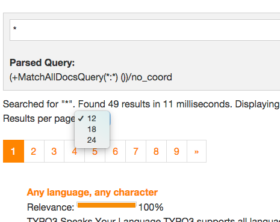

================
Results per Page
================

EXT:solr allows you to configure how many result per page will be shown and at the same time the user can also change
this value to an allowed value.

The following configuration can be used to configured the results per page:

.. code-block:: typoscript

    plugin.tx_solr {
        search {
            results {
                resultsPerPage = 6
                resultsPerPageSwitchOptions = 12, 18, 24
            }
        }
    }

When you apply the configuration above, the frontend will show 6 search results by default and show the options 12, 18 and 24
to the user to change the amount of visible results

    Results per page

**Templating**

The rendering of the "perPage selector" is done on "Resources/Private/Partials/Frontend/Results/PerPage.html". This partial is build in a way that the behaviour of the perPage selector is the same as in EXT:solr. If you want to do your custom rendering for example with links instead of a for, you can customize the rendering there.

