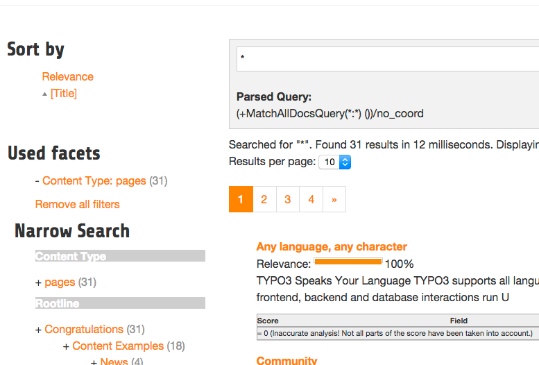

=======
Sorting
=======

When no sorting is selected the search will order the results by **"relevance"**. This relevance is calculated by many factors and has the goal to deliver
the best result for the query on the first position. That's what you expect from a search :)

For some usecases you want to change the sorting of the results by a certain field. In an onlineshop a user might want to order the results
by the price to find the cheapest product that is matching his query.

A simple sorting can be configured with the following typoscript snipped:

.. code-block:: typoscript

	plugin.tx_solr.search.sorting >
	plugin.tx_solr.search {
		sorting = 1
		sorting {
			defaultOrder = asc

			options {
				relevance {
					field = relevance
					label = Relevance
				}

				title {
					field = sortTitle
					label = Title
				}
			}
		}
	}

With the configuration above the possibility to sort by title is introduced. At the same time the sort by relevance link can be used to
reset the sorting to sort by the natural solr relevance.

    Search with sorting

**Templating**

The rendering of the sorting is done on "Resources/Private/Partials/Results/Sorting.html" this partial is using the configuration and
the view helpers to generate sorting links with the same behaviour as in ext:solr. For sure you can modifiy this template and use the ViewHelpers
in the way how you want to implement your custom sorting.
