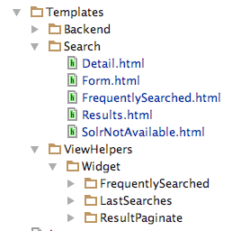

========================
Fluid Template Structure
========================

First we start with a short overview of the template structure. This is just to get an rought overview. The templates will be explained in
detail in the template where they belong to:

* Layouts: Layouts that are used in the search and the faceting.
* Partials:
    * **Facets**: Partials that are use to render the specific facet types.
    * **Result**: Partials that are used during the result rendering (e.g. to render the result document, sorting or perPage selector)
    * **Search**: Partials that are used for the search also when no search was executed.
* Templates:
    * **Search**: All templates that are used to render the actions in the SearchController
    * **ViewHelper**: All templates that are use in the widgets (FrequentSearched, LastSearches, ResultPaginate)

All backend related files are in a "Backend" folder. Everything else is frontend related.
