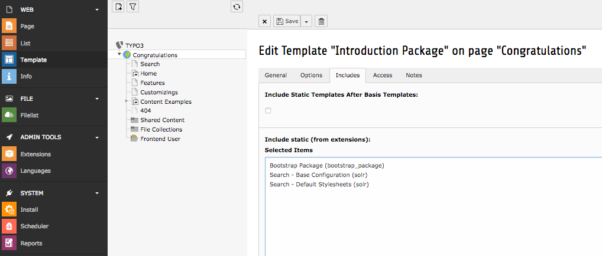

.. highlight:: typoscript

.. _started-configure-extension:

Configure Extension
===================

After :ref:`started-install-extension` you need to configure the extension. Only a few steps from below are necessary for :ref:`started-index`.

Static TypoScript
-----------------

The extension already comes with basic configuration that will work for small pages out of the box. For now create, or
edit an existing, TypoScript Template record in your page tree and add the provided static TypoScript:

Search Markers
--------------

EXT:solr is indexing everything on a page between `<!-- TYPO3SEARCH_begin -->` and `<!-- TYPO3SEARCH_end -->` to ensure this is the case, check the output of you website and add the markers to your template.

If the markers are missing, you should add them to your template. To increase the quality of the search results the markes should only wrap the relevant content of a page and exclude e.g. menus, because they are same on each page.

The most simple configuration for my page was:

.. code-block:: typoscript

    page.10 {
        stdWrap.dataWrap = <!--TYPO3SEARCH_begin-->|<!--TYPO3SEARCH_end-->
    }

Site Handling or Legacy site mode
---------------------------------

Site Handling (recommended)
~~~~~~~~~~~~~~~~~~~~~~~~~~~

TYPO3 9.5 LTS `introduced <https://docs.typo3.org/m/typo3/reference-coreapi/9.5/en-us/ApiOverview/SiteHandling/Basics.html />`_ new concept for configuring sites.
This method should be preferred from "Legacy site Mode". All the Legacy Site mode things will be removed in feature releases of TYPO3 and EXT:Solr.

@Todo: Screenshots, site config.yml code blocks and vars, etc.

Legacy site mode (not recommended)
~~~~~~~~~~~~~~~~~~~~~~~~~~~~~~~~~~

.. include::ConfigureExtensionLegacySiteMode

.. include::