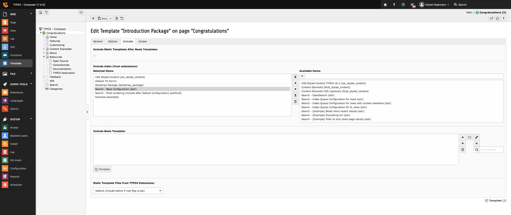

.. highlight:: typoscript

.. _started-configure-extension:

Configure Extension
===================

After :ref:`started-install-extension` you need to configure the extension. The extension already
comes with basic configuration that will work for small pages out of the box. For further
configuration options head over to :ref:`started-index` once everything is setup.

Static TypoScript
-----------------

For now create, or edit an existing, TypoScript Template record in your page tree and add the
provided static TypoScript:

Update the constants to match the current setup:

|

.. code-block:: typoscript

    plugin {
        tx_solr {
            solr {
                host = 192.168.99.100
                port = 8983
            }
        }
    }

Adjust the host according to where your Solr is reachable, see :ref:`started-solr`.

Search Markers
--------------

EXT:solr is indexing everything on a page between `<!-- TYPO3SEARCH_begin -->` and `<!-- TYPO3SEARCH_end -->` to ensure this is the case, check the output of you website and add the markers to your template.

If the markers are missing, you should add them to your template. To increase the quality of the search results the markes should only wrap the relevant content of a page and exclude e.g. menus, because they are same on each page.

The most simple configuration for my page was:

|

.. code-block:: typoscript

    page.10 {
        stdWrap.dataWrap = <!--TYPO3SEARCH_begin-->|<!--TYPO3SEARCH_end-->
    }

Domain Records and Indexing
---------------------------

To enable Solr connections, the extension needs a Domain Record and indexing has to be enabled.
Therefore enable indexing by setting the following TypoScript:

|

.. code-block:: typoscript

    config {
        index_enable = 1
    }

Also define that your root page is actually a root page:

.. image:: /Images/GettingStarted/typo3-root-page.png

Last but not least, add the domain record to the root page:

.. image:: /Images/GettingStarted/typo3-domain-record.png

Initialize Solr Connection
---------------------------

Next, initialize the Solr Connection from TYPO3 and check whether everything works as expected.

To initialize the connection, open the Cache-Menu and start Initialization.

.. image:: /Images/GettingStarted/typo3-initialize-connections.png

Check whether connections to Solr could be established by opening the *Reports* module and go to
*Status Report* view:

.. image:: /Images/GettingStarted/typo3-check-connections.png

That's it, head over to :ref:`started-index`.
