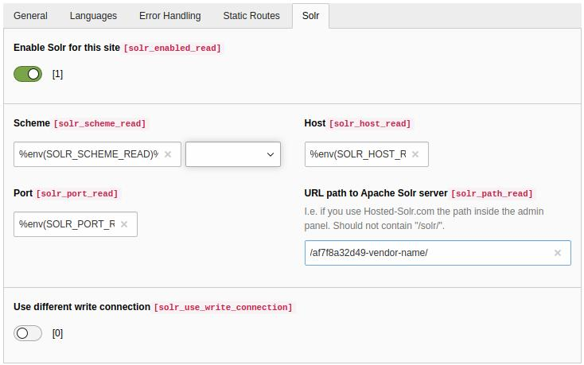
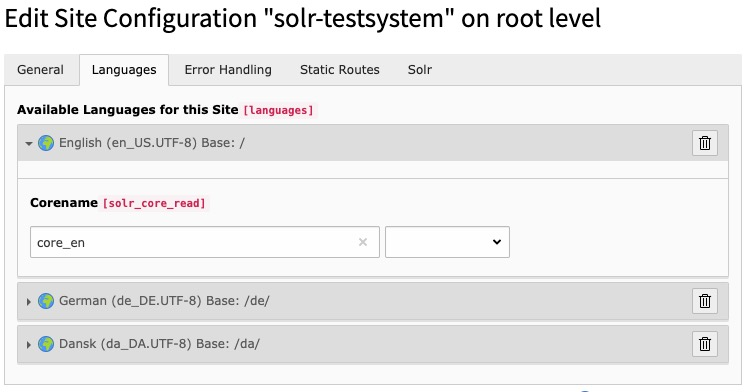

.. highlight:: typoscript

.. _started-configure-extension:

Configure Extension
===================

After :ref:`started-install-extension` you need to configure the extension. Only a few steps from below are necessary for :ref:`started-index`.

Static TypoScript
-----------------

The extension already comes with basic configuration that will work for small pages out of the box. For now create or
edit an existing TypoScript Template record in your page tree and add the provided static TypoScript:

.. image:: ../Images/GettingStarted/typo3-include-static-typoscript.png

.. _started-search-markers:

Search Markers
--------------

EXT:solr is indexing everything on a page between `<!-- TYPO3SEARCH_begin -->` and `<!-- TYPO3SEARCH_end -->` to ensure this is the case, check the output of you website and add the markers to your template.

If the markers are missing, you should add them to your template. To increase the quality of the search results the markes should only wrap the relevant content of a page and exclude e.g. menus, because they are same on each page.
The markers can be used multiple times, but make sure each "TYPO3SEARCH_begin" is properly closed with "TYPO3SEARCH_end".

The most simple configuration for my page was:

.. code-block:: typoscript

    page.10 {
        stdWrap.dataWrap = <!--TYPO3SEARCH_begin-->|<!--TYPO3SEARCH_end-->
    }

.. _started-enable-indexing:

Enable indexing
---------------

Indexing wil only work if you allow content to be indexed by stating so in your TypoScript setup configuration:

.. code-block:: typoscript

    config {
        index_enable = 1
    }

Site Handling
~~~~~~~~~~~~~

In TYPO3 9.5 the new backend module called "Sites" was introduced.
This Module can be used to setup and configure the Apache Solr connections.

    .. tip::

        Please refer to `official TYPO3 docs about site handling <https://docs.typo3.org/m/typo3/tutorial-getting-started/10.4/en-us/NextSteps/Integrators/Index.html#site-and-language-handling>`__, to setup your first site configuration.

.. warning::

   EXT:Solr needs a proper domain as base for the site. If the base is set to "/" or a similar relative path, the Indexing will throw an error, so please make sure that "base" is a fully qualified domain like "https://my.project.tld/"

Configure Solr Connections
""""""""""""""""""""""""""

.. important::

    The Site-Handling GUI provides the common setup scenario for most users only.
    There is no possibility in the GUI to setup different things for each language in site configuration except Corename(core path).

.. tip::

    All in sites config.yaml global defined thing for EXT:solr can be configured for each language differently by editing this file manually.

**As first step the authority part of URI to Apache Solr machine must be configured.**

**The Corename(aka path to core) for each available language must be assigned respectively.**

