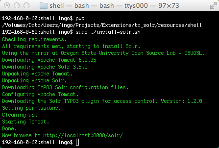

.. highlight:: bash

.. _started-solr:

Solr
====

First you need to install Solr itself. There are several ways to do so:

Using Hosted-solr.com
---------------------

If you want to start simple and just create a solr core with a click. You can use hosted-solr.com. For a small fee you get your own solr core in seconds, configured to be used with EXT:solr.

Shipped install script
----------------------

Please make sure to use a current Java SDK (JDK). We recommend using Oracle JDK.

We have included an install script to automatically set up Tomcat and Solr. You
can find it in EXT:solr/Resources/Install/install-solr-tomcat.sh.

That shell script will do a full setup, downloading a recent version of Apache
Tomcat and Apache Solr in a version as required by EXT:solr. The script installs
Tomcat and Solr into ``/opt/solr-tomcat/`` and when done starts Tomcat.

Install Solr with an english core:

|

.. code-block:: bash

    $ sudo ./install-solr-tomcat.sh

Install Solr with additional languages - simply list them separated with space

|

.. code-block:: bash

    $ sudo ./install-solr-tomcat.sh english german french

This will download schema configuration files for english, german, and french.
You still need to add the cores in ``/opt/solr-tomcat/solr/solr.xml``. An
english core is already configured, you can simply copy the configuration and
adapt the paths for the ``schema`` and ``dataDir`` attributes.

    Install script output (shortened).

Docker
---------------------------------

We provide 2 Dockerfiles for this extension. You can find them in the root directory of the extensions source.
For minimal installation you can use `Dockerfile` and for a complete and ready to use docker image you can use `Dockerfile_full`.

The minimal installation copy all settings, but doesn't create the solr cores. 

To build the images, simply type one of the following:

|

.. code-block:: bash

    docker build -t solr .
    docker build -t solr-full -f Dockerfile_full .
	
To run the container (only run one of the following):

|

.. code-block:: bash

    docker run -d -p 8983:8983 solr
    docker run -d -p 8983:8983 solr-full

If you want to keep the solr core data after a recreate of the container, you have to share `/opt/solr/server/solr/data` (please note: the directory on the host should have UID and GID 8983) to the host.

To check whether Solr is up and running head over to:

``http://<ip>:8983/solr/#/core_en/query``.

You should see the web interface of Solr to run queries:

.. figure:: ../Images/GettingStarted/solr-query-webinterface.png

|

You now have a fully working, pre configured Solr running to start with
:ref:`started-install-extension`.
