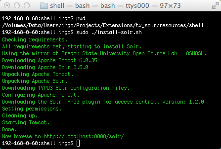

.. highlight:: bash

.. _started-solr:

Solr
====

First you need to install Solr itself. There are several ways to do so:

Shipped install script
----------------------

Please make sure to use a current Java SDK (JDK). We recommend using Oracle JDK.

We have included an install script to automatically set up Tomcat and Solr. You
can find it in EXT:solr/Resources/Install/install-solr-tomcat.sh.

That shell script will do a full setup, downloading a recent version of Apache
Tomcat and Apache Solr in a version as required by EXT:solr. The script installs
Tomcat and Solr into ``/opt/solr-tomcat/`` and when done starts Tomcat.

Install Solr with an english core:

.. code-block:: bash

    $ sudo ./install-solr-tomcat.sh

Install Solr with additional languages - simply list them separated with space

.. code-block:: bash

    $ sudo ./install-solr-tomcat.sh english german french

This will download schema configuration files for english, german, and french.
You still need to add the cores in ``/opt/solr-tomcat/solr/solr.xml``. An
english core is already configured, you can simply copy the configuration and
adapt the paths for the ``schema`` and ``dataDir`` attributes.

    Install script output (shortened).

Docker (not officially supported)
---------------------------------

Install a docker image providing ready to use Solr for TYPO3.  To do so install the docker image `writl/solr-typo3 <https://hub.docker.com/r/writl/solr-typo3/>`_ e.g. by running the following in
your shell::

    docker pull writl/solr-typo3
    docker run -it -p 8282:8080 -v $(pwd):/opt/solr-tomcat/solr/typo3cores/data writl/solr-typo3

Wait until Solr did start which is indicated by output like:

.. code-block:: text

    26-May-2016 15:50:14.921 INFO [main] org.apache.coyote.AbstractProtocol.start Starting ProtocolHandler ["http-nio-0.0.0.0-8080"]
    26-May-2016 15:50:14.951 INFO [main] org.apache.catalina.startup.Catalina.start Server startup in 69500 ms

To check whether Solr is up and running head over to ``http://localhost:8282/solr/#/core_en/query``.
If you are using Mac OS X you need the IP of docker-machine, do so by running::

    docker-machine url | sed 's/tcp/http/' | sed 's/:[[:digit:]].*/:8282/' | sed 's:$:/solr/#/core_en/query:'

And open the displayed URL, like ``http://192.168.99.100:8282/solr/#/core_en/query``. You should see
the web interface of Solr to run queries:

.. image:: /Images/GettingStarted/solr-query-webinterface.png

You now have a fully working, pre configured Solr running to start with
:ref:`started-install-extension`.
