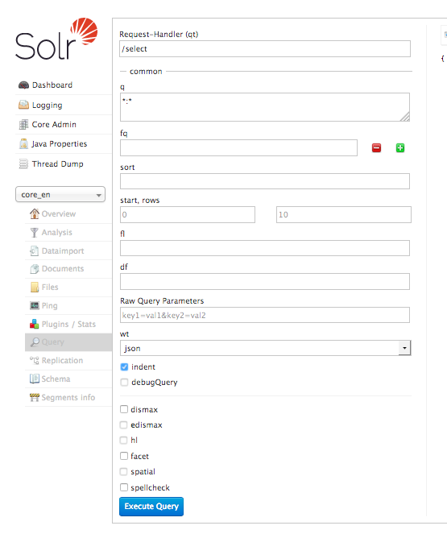

.. highlight:: bash

.. _started-solr:

Solr
====

First you need to install Solr itself. There are several ways to do so:

Using Hosted-solr.com
---------------------

If you want to start simple and just create a solr core with a click. You can use hosted-solr.com. For a small fee you get your own solr core in seconds, configured to be used with EXT:solr.

Shipped install script
----------------------

With the extension we ship and install script that can be used for a **development** context. It creates a solr server with a core for all languages.
This script is located in "Resources/Private/Install" an it installs a configured solr server that is useable with EXT:solr.

By default this script is not executable and you need to add the execute permissions to your user to run it.

The example below shows how to install a solr server to /home/developer

.. code-block:: bash

    chmod u+x ./Resources/Private/Install/install-solr.sh
    ./Resources/Private/Install/install-solr.sh -d /home/developer

After running the script you are able to open a solr server with over the loopback address. Which means, when you want to access it from outside, you need to create an ssh tunnel.

Docker
------

You can use docker to install your solr server with a small effort. With the extension we provide a Dockerfile, that creates a container with a core for all languages ready to run.
This helps you to setup a container very quickly.

To build the images, simply type one of the following:

.. code-block:: bash

    docker build -t typo3-solr Docker/SolrServer/Dockerfile .

Prepare the data folder (data is shared with the docker container by user and group with UID/GID 8983):

.. code-block:: bash

    mkdir -p .solrdata
    chmod g+w .solrdata
    chown :8983 .solrdata

To run the container (only run one of the following):

.. code-block:: bash

    docker run -d -p 127.0.0.1:8983:8983 -v "$PWD/.solrdata:/var/solr/data/data" typo3-solr

To check whether Solr is up and running head over to:

``http://<ip>:8983/solr/#/core_en/query``.

You should see the web interface of Solr to run queries:

**Important**: The image "typo3-solr" ships a default core for all languages. The data of the cores is stored on a data volume. When you want to update the container, you can just start a new container using the data volume of the old container. But at the same time this has the limitation, that you should only use this image with the default cores! If you want to create custom cores with a different configuration please read the section "Advanced Docker Usage"

Please note: The steps above show how to build the image from the Dockerfile. You can also download and use our compiled images from dockerhub:

https://hub.docker.com/r/typo3solr/ext-solr/

Advanced Docker Usage
^^^^^^^^^^^^^^^^^^^^^

Our image has the intension to create running cores out of the box. This implies, that the schema is inside the container.
The intension in our integration was to stay as close as possible to the official Apache Solr docker images. Sometimes it might make
sence that you use the official image directly instead of our image. An example could be when you want to have the solrconfig, schema and data outside of the container.

The following example shows how you can run our configuration with the official Apache Solr docker container by mounting the configuration and data from a volume (When using Docker on macOS make sure you've added the volume folder to "Preferences -> File Sharing").

.. code-block:: bash

    mkdir -p ~/mysolr
    cp -r Resources/Private/Solr/* ~/mysolr
    sudo chown -R :8983 ~/mysolr
    docker run -d -p 127.0.0.1:8983:8983 -v ~/mysolr:/var/solr/data/data solr:6.3.0

Other Setup
-----------

Beside the install script and Docker there are various possibilities to setup solr. All of these possibilities are not
officially supported, but the simplify the setup i want to mention them shortly here and summarize the needed steps.

Known Installers
^^^^^^^^^^^^^^^^

All of these installers can be used to setup a plain, reboot save solr server:

* Use the installer shipped with solr itself (bin/install_solr_service.sh):

Allows to install solr on many distributions including init scripts (At the time of development ubuntu 16.04 was not supported and therefore it was no option for us to use it).

* Use chef / ansible / whatever dev ops tool:

Allows you to setup a solr server with your DevOps tool.

e.g. https://galaxy.ansible.com/geerlingguy/solr/ (ansible) or https://supermarket.chef.io/cookbooks/solr (chef)

Deployment of EXT:solr configuration into Apache Solr
^^^^^^^^^^^^^^^^^^^^^^^^^^^^^^^^^^^^^^^^^^^^^^^^^^^^^

Since EXT:solr 6.0.0 the configuration and all jar files are shipped in one "configSet". The goal of this approach is to make the deployment much easier.

All you need to do is, you need to copy the configSet directory into your prepared solr installation and replace the solr.xml file. In the installer we do it like this:

.. code-block:: bash

    cp -r ${EXTENSION_ROOTPATH}/Resources/Private/Solr/configsets ${SOLR_INSTALL_DIR}/server/solr
    cp ${EXTENSION_ROOTPATH}/Resources/Private/Solr/solr.xml ${SOLR_INSTALL_DIR}/server/solr/solr.xml

After this, you can decide if you want to create the default cores by copying the default core.properties files or if you want to create a core with the solr rest api.

Copy the default cores:

.. code-block:: bash

    cp -r ${EXTENSION_ROOTPATH}/Resources/Private/Solr/cores ${SOLR_INSTALL_DIR}/server/solr

Create a core with the rest api:

.. code-block:: bash

    curl "http://localhost:8983/solr/admin/cores?action=CREATE&name=core_de&configSet=ext_solr_8_0_0&schema=german/schema.xml&dataDir=../../data/german"

After installing the solr server and deploying all schemata, the TYPO3 reports module helps you to verify if your setup fits to the requirements of EXT:solr

You now have a fully working, pre configured Solr running to start with

No you can continue with installing the extension :ref:`started-install-extension`.
