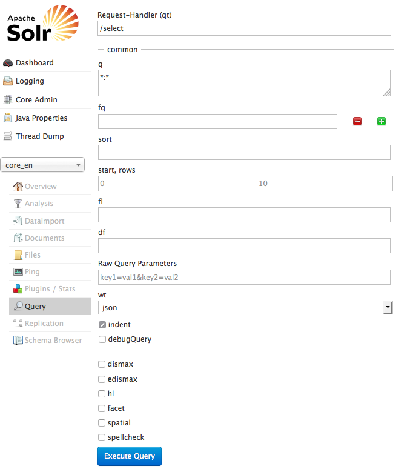

.. highlight:: bash

.. _started-solr:

Solr
====

First you need to install Solr itself. There are several ways to do so:

Using Hosted-solr.com
---------------------

If you want to start simple and just create a solr core with a click. You can use hosted-solr.com. For a small fee you get your own solr core in seconds, configured to be used with EXT:solr.

Shipped install script
----------------------

With the extension we ship and install script that can be used for a **development** context. It creates a solr server with a core for all languages.
This script is located in "Resources/Private/Install" an it installs a configured solr server that is useable with EXT:solr.

By default this script is not executable and you need to add the execute permissions to your user to run it.

The example below shows how to install a solr server to /home/developer

|

.. code-block:: bash

    chmod u+x ./Resources/Private/Install/install-solr.sh
    ./Resources/Private/Install/install-solr.sh -p /home/developer

|

After running the script you are able to open a solr server with over the loopback address. Which means, when you want to access it from outside, you need to create an ssh tunnel.

Docker
------

We provide 2 Dockerfiles for this extension. You can find them in the root directory of the extensions source.
For minimal installation you can use `Dockerfile` and for a complete and ready to use docker image you can use `Dockerfile_full`.

The minimal installation copy all settings, but doesn't create the solr cores, the full image contains an example core for all languages.

To build the images, simply type one of the following:

|

.. code-block:: bash

    docker build -t solr .
    docker build -t solr-full -f Dockerfile_full .
	
To run the container (only run one of the following):

|

.. code-block:: bash

    docker run -d -p 8983:8983 solr
    docker run -d -p 8983:8983 solr-full

If you want to keep the solr core data after a recreate of the container, you have to share `/opt/solr/server/solr/data` (please note: the directory on the host should have UID and GID 8983) to the host.

To check whether Solr is up and running head over to:

``http://<ip>:8983/solr/#/core_en/query``.

You should see the web interface of Solr to run queries:

|

You now have a fully working, pre configured Solr running to start with
:ref:`started-install-extension`.
