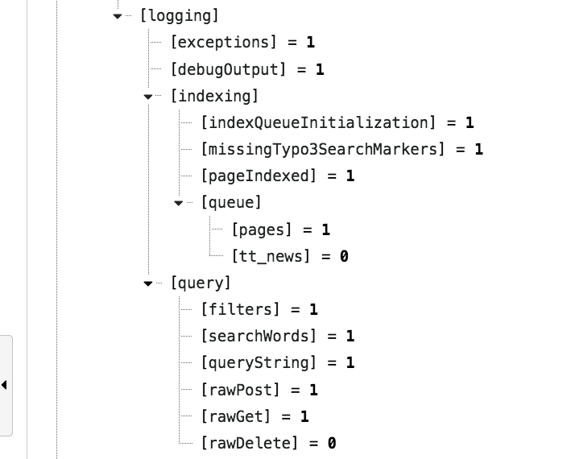

Configure Logging
-----------------

There are several options that can be configured with TypoScript:

    EXT:solr logging settings

You can find a detailed description of all options in the ":ref:`conf-tx-solr-logging`" section in the reference.

Note: Make sure that you log on production only what you need, because log data can increase very quickly.

In the next steps we want to see as example how we can use the debug output to see which query was triggered in solr.

The first step is to debug the output for "rawGet":

|

.. code-block:: typoscript

    plugin.tx_solr.logging.query.rawGet = 1

