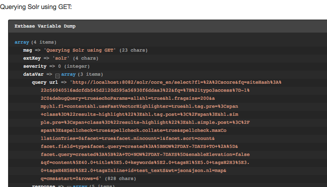

Show Logging Output
-------------------

As written in the introduction, the devLog functionally is used to write the log entries. You can use any available devLog extension from TYPO3 to browse written log entries.

For a quick debugging without any extension there is the possibility to show the debug messages directly:

- For the frontend as formatted output.
- For the backend as TYPO3 console output.

|

**Note:** You should use this on a development system only and make sure that the devIPmask does not allow other users to see the debug output.

|

To enable this features you need to:

- Make sure that your ip address is configured to match the devIPMask ($GLOBALS['TYPO3_CONF_VARS']['SYS']['devIPmask'])
- Enable the devLog debug output in the EXT:solr typoscript:

|

.. code-block:: typoscript

    plugin.tx_solr.logging.debugDevlogOutput = 1

You can now see the written log in the frontend:

    EXT:solr frontend debug output

